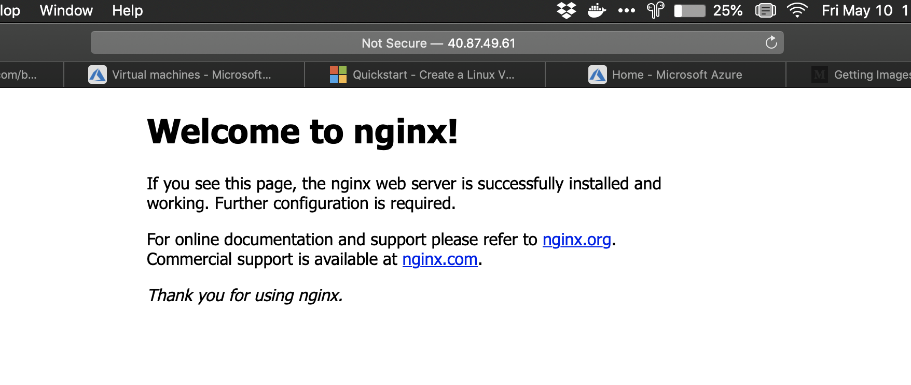

[//run]: # (pandoc instructions.rmd -o instructions.pdf && open instructions.pdf)

\tableofcontents
\newpage

# DOWNLOAD AND LOGIN

```(bash)
brew update && brew install azure-cli

az login
```

# CREATE AN UBUNTU VM

```(bash)
az group create --name vmUbuntu --location northeurope

az vm create \
  --resource-group vmUbuntu \
  --name vmUbuntu1 \
  --image UbuntuLTS \
  --admin-username juancasado \
  --generate-ssh-keys
```

Al ejecutar este comando debemos guardar la IP pública que se nos genera para usarla posteriormente.

## Open port 80 for web trafic

```(bash)
az vm open-port --port 80 \
--resource-group vmUbuntu --name vmUbuntu1
```

## Intall webserver

```(bash)
ssh juancasado@${publicIPUbuntu}
sudo apt-get -y update
sudo apt-get -y install nginx
```

With the public IP of the webserver you will be able to see from the browser the server



## Cleanup resources

Esta instrucción está desactualizada en la documentación web, en ella se utiliza el tag -name para indicar el nombre del grupo de recursos, se debe utilizar --resource-group en su lugar

```(bash)
az group delete --resource-group vmUbuntu
```

\newpage

# Create Windows VM

```(bash)
az group create --name vmWindows --location northeurope

az vm create \
    --resource-group vmWindows \
    --name vmWindows1 \
    --image win2016datacenter \
    --admin-username juancasado \
    --admin-password safePassword123
```

## Open port 80 for web trafic

```(bash)
az vm open-port --port 80 \
--resource-group vmWindows --name vmWindows1
```

Tenemos que cuardar la ip que obtengamos al ejecutar este comando.

## Conect to the virtual machine

```(PowerShell)
#Need to run in PowerShell
mstsc /v:${publicIPWindows}
```

Para hacer el login debemos seleccionar otra cuenta y usar las credenciales que hemos establecido al crear la máquina virtual.


## Cleanup Resources

```(bash)
az group delete --name vmWindows
```

# Crear un proceso en powershell

Para ellos desde la página de azure activamos el uso de power shell en la barra superior a la derecha.
Se nos solicitará crear un cloud drive para poderla usar lo cual se hará de forma automática.

## Crear el proceso

El proceso que vamos a crear desde esta powershell será una máquina virtual windows en azure.
Debemos usar una contraseña de más de 8 caractres con números, mayúsculas y letras y al menos un caracter especial.

```(powerShell)
New-AzResourceGroup -Name powerShellProcess -Location northeurope
$cred = Get-Credential -Message "username and password for the vm"
$vmParams = @{
  ResourceGroupName = 'powerShellProcess'
  Name = 'wVMprocess'
  Location = 'northeurope'
  ImageName = 'Win2016Datacenter'
  PublicIpAddressName = 'wVMprocessIP'
  Credential = $cred
  OpenPorts = 3389
}
$newVM1 = New-AzVM @vmParams
```

## Comprobar la creación de la máquina virtual

Podremos ver las características de la vm.

```(powerShell)
$newVM1
$newVM1.OSProfile | Select-Object ComputerName,AdminUserName
$newVM1 | Get-AzNetworkInterface |
Select-Object -ExpandProperty IpConfigurations |
  Select-Object Name,PrivateIpAddress
```

## Conexión a la maquina virtual creada

Obtenemos la IP de nuestra máquina virtual

```(powerShell)
$publicIp = Get-AzPublicIpAddress -Name wVMprocessIP |
  -ResourceGroupName powerShellProcess
$publicIp | Select-Object Name,IpAddress,@{label='FQDN';expression={$_.DnsSettings.Fqdn}}
```

Ahora desde el panel de azure buscamos nuestra máquina virtual, la seleccionamos y hacemos click en *connect*.
Se nos descargará un archivo **.rdp** que podremos usar para entrar en nuestra máquina virtual con las credenciales que indicamos anteriormenter.


# Crear un recurso compartido

Crearemos el recurso desde azure cli.

## Crear una cuenta de almacenamiento

Primero deberemos crearnos una cuenta de almacenamiento para poder crear el recurso compartido en ella.

```(bash)
az group create \
--name crearRecursoCompartido \
--location westus
az storage account create \
--name cuentarcompartido \
--resource-group crearRecursoCompartido \
--location westus \
--sku Standard_RAGRS \
--kind StorageV2
```

## Creación del recurso

Crearemos el recurso desde azure cli

```(bash)
current_env_conn_string=$(az storage account show-connection-string \
-n cuentarcompartido -g crearRecursoCompartido \
--query 'connectionString' -o tsv)
if [[ $current_env_conn_string == "" ]]; then  
    echo "Couldn't retrieve the connection string."
fi
az storage share create --name sharedfile --quota 2048 \
--connection-string ${current_env_conn_string}
```

## Conectarnos al recurso compartido desde Windows

Montamos el recurso en un disco nuevo de modo que podemos acceder a él creando un mapa de red a la dirección que se nos proporciona al haberlo creado.
Para poder acceder a él debemos de estar fuera de la red de eduroam.

```(bash)
Test-NetConnection -ComputerName \
cuentarcompartido.file.core.windows.net -Port 445
# Save the password so the drive will persist on reboot
Invoke-Expression -Command "cmdkey /add:cuentarcompartido.file.core.windows.net \
/user:Azure\cuentarcompartido /pass:sxSZrZtlEizk38a2+oQvaAUV5/zsrD+5YrCfIAW4xWGdXIoWyY/m8hqM6gJkeISIovVb537s3WpTnwvFiTXT+A=="
# Mount the drive
New-PSDrive -Name A -PSProvider FileSystem\
 -Root "\\cuentarcompartido.file.core.windows.net\sharedfile"
```


# Visual Studio 

Necesitamos crear un grupo de recursos con una máquina virtual en él.
En la máquina habilitamos los puertos HTTP y RDP para poder acceder.
Posteriormente creamos una virtual Network con una IP pública para poder acceder a ella desde fuera.

Una vez la máquina virtual ha sido creado y se ha instalado el visual studio 2017 accedemos a ella por rmd y comprobamos la instalación abriendo visual studio.


# Escalabilidad horizontal y vertical

La realizaremos desde App Services.

## Creación de la aplicación

Para ello descargamos el zip con una aplicación de ejemplo desde azure *https://github.com/Azure-Samples/nodejs-docs-hello-world/archive/master.zip*
Probamos la aplicación con 

```(bash)
npm start
```
Posteriormente creamos un .zip con los archivos.

```(bash)
zip -r myAppFiles.zip .
```

## Subir la aplicación

Creamos un grupo de recursos y un plan desde el que servir la aplicación.

```(bash)
az group create --name appScaleResources \
--location "South Central US"
az appservice plan create --name appScale \
--resource-group appScaleResources --sku FREE
az webapp create --resource-group appScaleResources \
--plan appScale --name appScaleApp
az webapp config appsettings set --resource-group appScaleResources \
--name appScaleApp --settings WEBSITE_NODE_DEFAULT_VERSION=10.14.1
```

Accedemos ahora a *https://appscaleapp.scm.azurewebsites.net/ZipDeployUI* donde podremos subir el zip que hemos creado previamente.
Accesiendo ahora a *http://appscaleapp.azurewebsites.net* podremos ver nuestra aplicación.

## Escalar la aplicación

Podremos acceder ahora desde el panel de azure a las opciones de eslacalado de nuestra aplicación las cuales estarán restrigidas en función del plan que hayamos elegido para ella.

* Scale up realiza el escalado vertical: dar más poder de cómputo a nuestra aplicación.
* Scale out realiza el escalado horizonatal: crear más instancias que se banlaceen de forma automática a nuestra aplicación.


## Borrar recursos

Podremos borrar los recursos que hemos creado borrando el grupo de recursos.

```(bash)
az group delete --name appScaleResources
```

# Power BI con datos en Azure

Descargamos la aplicación de Power BI desktop para Windows.

Creamos una base de datos SQL desde azure en un nuevo grupo de recursos.
Desde power BI nos connectamos al servidor en modo base de datos SQL azure.
Nos proporcionará una ip que debemos aplicar a la base de datos en azure.

Tomamos los datos que se crean por defecto en la base de datos para crear una representación gráfica de ellos.
En PowerBI seleccionamos algunos de eosos datos y con ellos cremos una representación gráfica.

