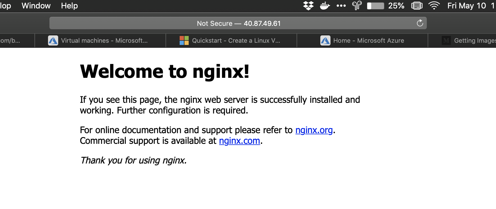

\tableofcontents
\newpage

# DOWNLOAD AND LOGIN

```bash
brew update && brew install azure-cli

az login
```

# CREATE AN UBUNTU VM

```bash
az group create --name vmUbuntu --location eastus

az vm create \
  --resource-group vmUbuntu \
  --name vmUbuntu1 \
  --image UbuntuLTS \
  --admin-username juancasado \
  --generate-ssh-keys
```

## Open port 80 for web trafic

```bash
az vm open-port --port 80 --resource-group vmUbuntu --name vmUbuntu1
```

Got a publicIpAddress of : 40.87.49.61

## Intall webserver

```bash
ssh juancasado@40.87.49.61
sudo apt-get -y update
sudo apt-get -y install nginx
```

With the public IP of the webserver you will be able to see from the browser the server



## Cleanup resources

Esta instrucción está desactualizada en la documentación web, en ella se utiliza el tag -name para indicar el nombre del grupo de recursos, se debe utilizar --resource-group en su lugar

```bash
az group delete --resource-group vmUbuntu
```

\newpage

# Create Windows VM

```bash
az group create --name vmWindows --location eastus

az vm create \
    --resource-group vmWindows \
    --name vmWindows1 \
    --image win2016datacenter \
    --admin-username juancasado \
    --admin-password safePassword123
```

## Open port 80 for web trafic

```bash
az vm open-port --port 80 --resource-group vmWindows --name vmWindows1
```

Got a publicIpAddress of : 23.96.9.254

## Conect to the virtual machine

```PowerShell
#Need to run in PowerShell
mstsc /v:23.96.9.254
```

## Cleanup Resources

```bash
az group delete --name vmWindows
```
